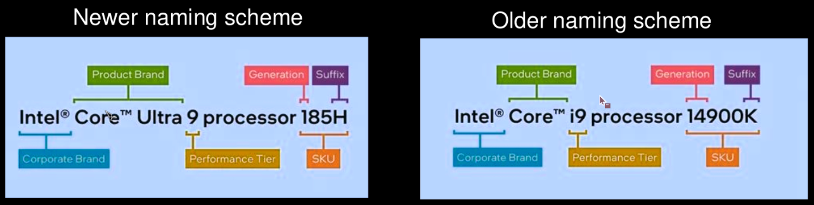
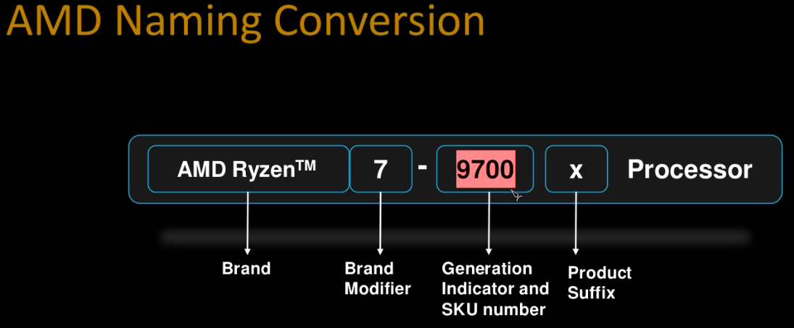
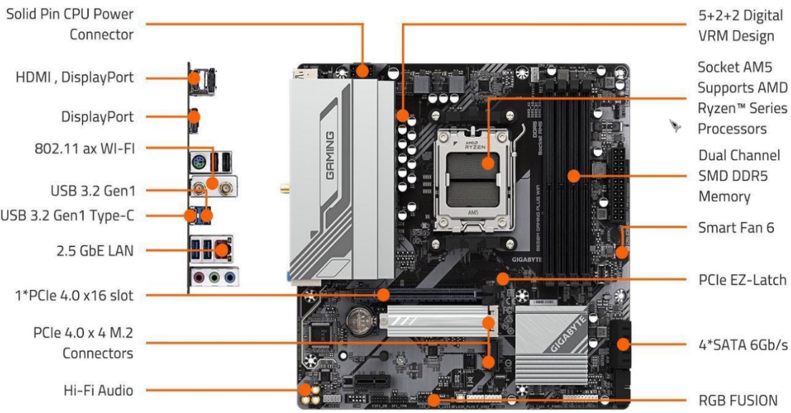
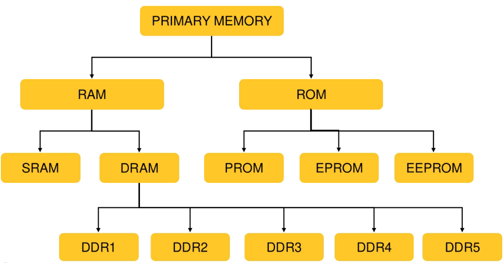
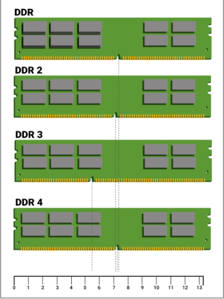
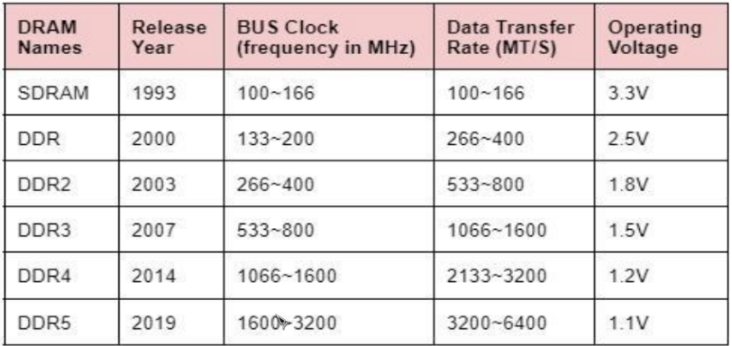
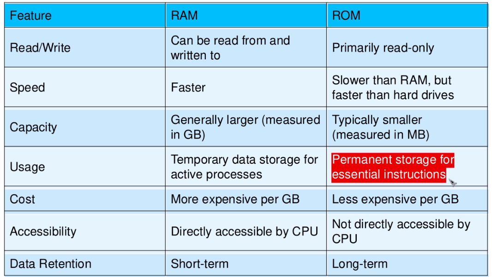
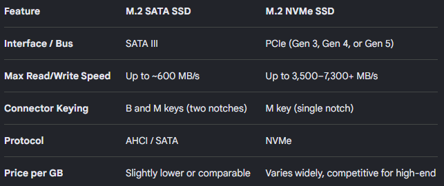

# What is a Computer?

* A computer is a programmable electronic device that accepts raw data as input and

processes it with a set of instructions (a program) to produce the result as output.

* A computer is designed to execute applications and provides a variety of solutions through

integrated hardware and software components.

\_\_\_\_\_\_\_\_\_\_

# Von Neumann Architecture

The Von Neumann Architecture is a computer design layout created by physicist John von Neumann in 1945. It uses a single, shared memory space to hold both program instructions and data. Most modern computers follow this core stored-program concept.

# Main Parts of the System
CPU (Central Processing Unit): The core brain that processes information.
Control Unit (CU): Directs the flow of data and picks instructions from memory.
ALU (Arithmetic Logic Unit): Does math and logic checks (like addition or comparisons).
Registers: Tiny, fast memory spots inside the CPU that hold temporary data.
Memory Unit (RAM): One shared space holding both the active program and its data.
I/O Devices: Tools like keyboards, screens, and mice used to input or output data.
System Bus: A shared pathway connecting the CPU, memory, and input/output parts.

# How It Works
Fetch-Decode-Execute Cycle: The CPU fetches an instruction from memory, decodes what it means, and runs it step by step.
Sequential Flow: Instructions run one after another along the same shared data path.

# Pros and Cons
Pros: Simple to build and design; data and programs use the same memory pool flexibly.
Cons: The Von Neumann bottleneck happens because the CPU cannot read an instruction and read/write data at the exact same time through the single shared bus, which can slow down processing speeds.

# Introduction to Computer Hardware

Processor

Motherboard

Primary Memory(RAM,ROM)

Secondary Memory (Storage Devices)

Graphics card

Cooling System

SMPS

Cabinet

\_\_\_\_\_\_\_\_\_\_\_

# Central Processing Unit (CPU)

* The CPU (Central processing unit) is the brain of a computer system.
* It interpret and execute most commands, working in coordination with other hardware and software components.
* A CPU consists of a microchip contains billions of tiny transistors that enable data processing.
* CPU performs various data processing tasks including stores data, managing intermediate results, and executing instructions (program).
* It plays a crucial role in controlling and coordinating all parts of a computer.

# CPU itself has following three compqnents

1) Registers

2) Control Unit

3) ALU(Arithmetic Logic Unit)

\_\_\_\_\_\_\_\_\_\_

# How to choose a CPU

1. **Socket**

* A socket is the interface on the motherboard that consists of an array of pins or holes, along with a securing mechanism, which holds the processor in place and establishes a connection between the CPU and the motherboard, enabling communication and power delivery.
* Major CPU manufacturers like Intel and AMD use distinctsocket types for their processors

# PGA (Pin Grid Array) Socket (Pins on CPU):

* The CPU has the pins, and they go into the corresponding holes in the motherboard socket.

# LGA Socket (Land Grid Array) (Pins on Motherboard):

* The motherboard has the pins, and the CPU has flat pads that make contact with the pins on the motherboard.

# BGA (Ball Grid Array):

* A processor that is permanently soldered directly onto a motherboard using an array of tiny solder balls instead of pins or a removable socket.
* It is widely used in laptops, mini-PCs, smartphones, and embedded systems where thinness and power efficiency are essential.

\_\_\_\_\_\_\_\_\_\_

# Intel Sockets:

# LGA 1151

* Used by Intel's 6th, 7th, 8th, and 9th generation processors.

# LGA 1200

* Used by Intel's 10th and 11th generation processors.
* This socket features a 1200-pin interface.

# LGA 1700

* Introduced for Intel's 12th and 13th generation.
* Supports performance and efficiency cores in a hybrid architecture.

# AMD Sockets:

# AM3 (PGA)

* Used by AMD's Phenom II and Athlon II processors.

* Supports DDR2 and DDR3 memory.

# AM4 (PGA)

* Used by AMD's Ryzen processors (Zen, Zen+, Zen 2, Zen 3) and APUs.
* Supports DDR4 memory.

# AM5 (LGA)

* Used for AMD Ryzen 7000 series processors (Zen 4).
* Supports DDR5 memory and PCIe 5.0.

\_\_\_\_\_\_\_\_\_\_\_

2. # Core & Threads

* Processor core are individual processing unit with in the Central Processing Unit.

* Core reads instructions to perform specific actions.

* Instructions are chained together so that, when run in real-time, they make up your computer experience.

* Threads are the virtual components, which divides the physical core of a CPU into virtual multiple cores.

* Multithreading is a CPU feature that allows two or more instruction threads to execute independently while sharing the same process resources.

\_\_\_\_\_\_\_\_\_\_\_

# Clock Speed

* The clock speed or clock rate of a processor refers to the rate at which it completes its processing cycle in one second. 
* It is measured in Hertz, typically in gigahertz (GHz).
* Base Frequency: This is the processor's standard operating speed under normal conditions.
* Turbo Frequency: Also known as Max Turbo Frequency, it represents the highest speed the processor can reach when utilizing InteD Turbo Boost Technology.

\_\_\_\_\_\_\_\_\_\_\_

# Cache Memory

* Supplementary memory system that temporarily stores frequently used instructions and data for quicker processing by the CPU of a computer.

# Primary Cache(L 1+L2 cache):
* Very fast and its access time is similar to the processor registers.
* This is because it is built onto the processor chip. its size is quite small.

# Secondary Cache(L3 cache):
* External cache is cache memory that is external to the primary cache. 
* It is located between the primary cache and the main memory.
* It is often housed on the processor chip as well.

\_\_\_\_\_\_\_\_\_\_\_

2. **Motherboard**

* The motherboard is a printed circuit board and foundation of a computer. 
* It is the largest board inside the computer chassis. 
* It allocates power and allows communication to and between the CPU, RAM, and all other computer hardware components.
* Key factors when selecting a motherboard

* Processor Socket
* Form factor
* Chipset

# Socket
* A motherboard (MOBO) socket is a physical connector on the circuit board that securely holds and links the central processing unit (CPU) to the rest of the computer.

# Motherboard Form Factors
* Form Factor refers to the size, shape, and layout of a motherboard, determining how components are arranged and how it fits inside a computer case. 
* The form factor ensures compatibility with standard cases and affects the overall design of the computer system. 
* There are various types of form factors, each suited to different types and sizes of computers, such as ATX, microATX, and minilTX, with each providing different levels of expandability and component placement based on their size and design.

* Extended-ATX - For Servers
* Standard-ATX - For Workstation/Desktop
* Micro-ATX - For Small Form Factor
* Mini-ITX - For Small Form Factor

# Chipset

* A Chipset group of electronic components on the motherboard that manages data between the processor, RAM, storage and other connected hardware. 
* Multiple chipsets are available per socket, allowing you to choose between budget and performance, with the more expensive motherboards sporting more capable components.

<-- A chipset is a silicon chip embedded on the motherboard that acts as the PC's traffic controller. It directs data between the CPU, storage drives, RAM, graphics card, and external ports. -->

# It manages the data flow between your hardware components through three main functions:

1. **The Traffic ControllerComponent Link:** It bridges data between the CPU and slower components like SSDs, hard drives, audio cards, and network adapters.USB & Peripheral Management: It routes signals from your mouse, keyboard, webcams, and external USB devices directly to the processor.

2. **The Feature ProviderExpansion Limits:** It dictates how many M.2 NVMe SSDs, SATA drives, and extra PCIe expansion cards you can plug into the motherboard.Special Settings: It turns on or blocks premium features like CPU overclocking, high-speed RAM profiles (XMP/EXPO), and RAID storage configurations.

3. **The Compatibility GatekeeperProcessor Matchmaker:** It ensures the motherboard can electronically talk to specific generations of CPUs, even if they share the same physical socket.

# Intel Supported Chipset
**H series :** budget chipsets for basic computing.
**B series :** Mid-range chipsets offering good performance.
**Z series :** High-end chipsets with overclocking support.

# AMD supported Chipset
**A series :** budget chipsets for basic computing.
**B series :** Mid-range chipsets offering good performance.
**X series :** High-end chipsets with overclocking support.
**TRX/WRX-Series:** Specialized workstation tiers for AMD Threadripper processors supporting massive multi-channel memory and vast PCIe lanes.

# Primary memory 

* Primary memory, or main memory, is the main workspace of a computer. 
* The CPU accesses it directly to hold data, programs, and instructions that are in active use. 
* It is much faster than secondary storage like hard drives, but it has a smaller capacity.

# Main Types of Primary Memory

# RAM (Random Access Memory): 
* Fast, temporary workspace that holds open apps and active data. 
* It loses everything when the power turns off (volatile).

# ROM (Read-Only Memory): 
* Permanent memory that stores vital startup and boot instructions (BIOS). 
* It keeps its data even when the computer turns off (non-volatile).

# Cache Memory: 
* Ultra-fast chip memory located close to the processor. It holds frequently used data to speed up tasks.

# <-- Direct Access | High Speed | Limited Size--> #

<--- RAM (Random Access Memory): -->

RAM is your computer's short-term digital workspace. 
It holds data the CPU needs right now for fast reading and writing. 

# Core Architecture Types

SRAM: Fast and used for cache memory, but costs more and is larger. It does not need regular refreshing.

DRAM: Uses capacitors and needs constant electrical refreshing. It is slower than SRAM but cheap for large system memory.

# Mainstream DDR Generations

DDR1 (2000): Runs at 2.5V with speeds up to 400 MHz.
DDR2 (2003): Runs at 1.8V with speeds up to 1066 MHz.
DDR3 (2007): Runs at 1.5V with speeds up to 2133 MHz.
DDR4 (2014): Runs at 1.2V with speeds up to 3200 MT/s using 288 pins.
DDR5 (2020): Runs at 1.1V starting at 4800 MT/s with built-in power management.

# Form Factors and Special Types

DIMM {Dual Inline Memory Module (Standard desktop and server RAM stick)}: Full-sized 133.35 mm modules for desktops.

SO-DIMM {Small Outline Dual Inline Memory Module (Smaller RAM stick for laptops)}: Small 69.6 mm modules for laptops.

CAMM2 {Compression Attached Memory Module 2 (New flat, space-saving laptop/desktop memory standard)}: Flat-mount modern laptop standard.

LPDDR {Low-Power Double Data Rate (Energy-saving RAM used in phones and thin laptops)}: Low-power soldered mobile memory.

GDDR {Graphics Double Data Rate (High-speed RAM built for video cards and GPUs)}: High-bandwidth memory for graphics cards.

ECC {Error-Correcting Code (Memory that finds and fixes data errors for high stability)}: Server memory that fixes data errors.

# Dynamic Random Access Memory

**DDR SDRAM(Double Data Rate Dynamic Random Access Memory)**
* The next generation of SDRAM is DDR, which achieves greater bandwidth than the preceding single data rate SDRAM by transferring data on the rising and falling edges of the clock signal (doublepumped).
* DDR1 SDRAM has been succeeded by DDR2, DDR3, and most recently, DDR5 SDRAM.

# Read Only Memory [ROM]
* ROM stands for Read-Only Memory. 
* It is a type of non-volatile computer memory that keeps its data even when the power is turned off. 
* It holds permanent startup instructions, like the BIOS, which helps a device turn on and load the operating system.

# Common Types of ROM

**MROM (Mask ROM):** Set permanently at the factory during building. 
**PROM (Programmable ROM):** Bought blank and written on one time by a user.
**EPROM (Erasable Programmable ROM):** Erased using ultraviolet light and reused.
**EEPROM (Electrically Erasable Programmable ROM):** Erased and rewritten using electrical signals.
**Flash Memory:** A fast modern type used in USB drives and solid-state drives.

# MROM (Mask ROM)
* Inside the PROM chip, there are small fuses which are burnt open during programming.

# EPROM (Erasable & Programmable Read Only Memory)
* EPROM is a type of ROM that can be reprogramed and erased many times
* EPROM can be erased by exposing it to ultra-violet light for a duration of up to 40 minutes.
* Need a special device called a PROM programmer or PROM burner to reprogram the EPROM.

# EEPROM (Electrically Erasable & Programmable Read Only Memory)
* EEPROM is programmed and erased electrically.
* It can be erased and reprogrammed about ten thousand times.
* Both erasing and programming take about 4 to 1 0 ms (millisecond).
* EEPROMs can be erased one byte at a time, rather than erasing the entire chip. Hence, the process of reprogramming is flexible but slow.

# Secondary Memory
* A secondary storage device refers to any non-volatile storage device that is internal or external to the computer.
* Secondary storage allows for the storage of data ranging from a few megabytes to petabytes.
* The fundamental characteristics of secondary storage are high capacity and low cost, although speed, reliability and portability might also be important

# Hard Disk Drives

An HDD (Hard Disk Drive) is a traditional data storage device that uses mechanical, spinning magnetic platters and moving read/write heads to store and retrieve digital files. 
It is non-volatile, meaning it keeps your data safe even when the computer turns off.

# How an HDD Works
Platters: Round magnetic disks spin at high speeds (such as 5,400 or 7,200 RPM).
Read/Write Head: A tiny arm floats just above the spinning disk to write or read data using magnetic patterns.
Controller: The circuit board acts as the brain, translating computer commands into physical movements.
Main Types of HDDsInternal HDDs: Installed inside desktop PCs or servers for main storage or large file libraries.
External/Portable HDDs: Housed in small protective cases and plug into USB ports for easy backups and travel.

# Solid State Drives

A Solid-State Drive (SSD) is a fast, silent storage device that uses microchips to store data permanently without any moving parts.
It relies on NAND flash memory and a controller brain to read, write, and organize data instantly using electrical charges.

# How an SSD Works

NAND Flash Chips: The core warehouse where data is kept inside microscopic cells as electrical ones and zeros. 
It remembers data even when your computer turns off.The Controller: The smart chip manager that directs traffic, finds where files live, cleans up old deleted files, and balances wear evenly across cells so the drive lasts longer.

DRAM Cache (Optional): A tiny, ultra-fast memory helper used on high-end drives to store a map of where files are located, making access even quicker.

# Main Types of SSDsBy Form Factor

**2.5-inch:** Matches the shape of standard laptop hard drives. It connects using separate data and power cables, usually running on the slower SATA protocol. 

**M.2:** Small form factor SSD thats plugs directly into the motherboard without cables. It comes in sizes like M.2 2280 (standard PCs) and M.2 2230 or M.2 2242 (handheld gaming devices), supporting ultra-fast NVMe speeds.

**mSATA:** A smaller, bare-circuit board version of the SATA drive. It was built for older thin laptops and tablets before M.2 took over. HAs a max bandwidth og 6Gbps.

**U.2 and U.3:** Resembles a thicker 2.5-inch drive but uses PCIe connections. These are built for high-end servers and enterprise workstations. 

**Add-In Card (AIC):** Resembles a graphics card and plugs into a standard PCIe slot on a desktop motherboard. Used for extreme performance or massive storage capacity.

**EDSFF (Enterprise and Datacenter Standard Form Factor):** Specialized "ruler-shaped" drives made for modern cloud servers. They optimize airflow and allow massive storage capacities in server racks. 
 
# Flash Cell (NAND) Types
 
 **SLC (Single-Level Cell):** Stores 1 bit per cell; fastest and most durable, but very costly.
 
 **MLC (Multi-Level Cell):** Stores 2 bits per cell; good mix of speed and cost.
 
 **TLC (Triple-Level Cell):** Stores 3 bits per cell; common and affordable for daily use.
 
 **QLC (Quad-Level Cell):** Stores 4 bits per cell; high capacity at a lower price, but slower.

 # Graphics Card

Graphics card is a hardware which is used to increase the video memory of a comp
uter, and make its display quality more high-definition.

It makes the computer more powerful and gives it the capacity to do more high-leve
I work. The quality of the image depends on the quality of the graphics card.

It is very much important for gaming and video editing on a PC. Every game needs
a graphics memory to start and it depends on the type of the game, and the require
ments are mentioned on the game box.

# Types of Graphics Card

# 1. Integrated Graphics: 

These are built directly into the processor, meaning they don't require a separate graphics card. They are commonly found in most laptops and are suitable for everyday tasks like browsing, office work, or media consumption. Since they share the system's memory (RAM), they cannot be upgraded or replaced.

# 2.Discrete Graphics: 
This refers to an external graphics card that is added to the motherboard as a sepa
rate component. While basic tasks like file creation, office work, or media consumption don't require a discrete GPU, more demanding activities like high-resolution gaming, 3D rendering, or video editing benefit from the power of a discrete graphics card. These cards have their own dedicated memory
and can be upgraded or replaced as needed.

Intel Arc B580

Radeon RX 9070 XT

GeForce RTX 5090

# How to choose a GPU?

Video memory (VRAM) in a graphics card is crucial for handling graphics tasks, storing image data,
textures, and frame buffers for faster access. More VRAM allows for better performance in high-resolution,
detailed, and complex graphics.(8GB,16GB,24GB .. etc)

GDDR (Graphics Double Data Rate) is the common type of VRAM used in modern cards. Versions like
GDDR5 and GDDR6 offer faster speeds and higher bandwidth, with GDDR6 providing improved
performance for demanding tasks like gaming and video editing.

# Cooling System

. Stoke Processor cooling

. Air cooling

. Liquid cooling - AIO,Custom

. Water Cooling - AIO,Submerge/Immersion Cooling

# SMPS

SMPS stands for Switched-Mode Power Supply.

SMPS - Switched Mode Power Supply.
It's main task is to provide Power supply to all the components of the PC.

It is an electronics device that is used to convert AC to DC, AC to AC, DC to DC and D
C to AC voltages.
The SMPS used in computers is of AC to DC type supply.

# Power Supply Unit

1. NON - MODULAR SMPS

A non-modular PSU comes with all the cables that you
will need for your build already installed and attached
to the power supply.

2. SEMI MODULAR SMPS

Semi modular units have a few power cables
that are permanently fused to the power
supply while the remaining ones can be
detached

3. FULLY MODULAR SMPS

Fully modular indicates that every power
connector is detachable and removable.
power supplies tend to have a full modular
design High end

# Cabinet

A computer case, also known as a computer chassis, is the enclosure that contains most of the components of a personal computer (usually excluding the display, keyboard, and mou
se).

Types of Cabinet :

. Full tower

. Mid tower

. Mini tower

· SFF(Small form factor)

# firmware

BIOS/UEFI

. BIOS and UEFI are forms of software that kickstart the hardware of your
computer before your operating system loads.

BIOS is a software stored on a small memory chip in the motherboard.
It is used to start the computer system after it is turned on.

Unified Extensible Firmware Interface (UEFI) is a specification for a software
program that connects a computer's firmware to its operating system (OS). UEFI is
expected to eventually replace BIOS(basic input/output system) but is compatible
with it.

# BIOS/UEFI

Secure Boot helps to make sure that your PC boots using only firmware that is

trusted by the manufacturer.

CSM stands for Compatibility Support Module. It's an optional tool included in the UEFI
firmware that allows legacy BIOS compatibility. CSM offers backward compatibility by

booting the machine as if you were running a legacy BIOS system.

